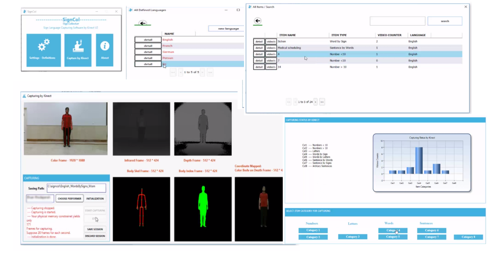

# SignCol

**SignCol**: Open-Source Software for Collecting Sign Language Gestures
**Sign Col**lector by Microsoft Kinect v2

This is a Microsoft Kinect-based open source software, called **SignCol**, for capturing and saving the gestures used in sign languages. Our work supports creating a **multi-language database** and reports the recorded items **statistics**. SignCol can capture and store **colored(RGB) frames**,**depth frames**, **infrared frames**, **body index frames**, **coordinate mapped color-body frames**, **skeleton information** of each frame and camera parameters **simultaneously**.

The main features of SignCol is 
- Captuting visual data 
- Defing the numbers, words, sentences and etc at the database 
- Track and report the recording status

# Paper
if you found this software usefull, please cite the following paper:

@inproceedings{SignCol,
  title={SignCol: Open-Source Software for Collecting Sign Language Gestures },
  author={Mohammad Eslami and Mahdi Karami and Sedigheh Eslami and Solale Tabarestani and Farah Torkamani-Azar and Christoph Meinel},
  booktitle={Software Engineering and Service Science (ICSESS), 2018 9th IEEE International Conference on},
  year={2018},
  organization={IEEE}
}

# Requirements

Followings are the requirements for a PC for compatibility with the Kinect v2 and SignCol: 
- $\ast$ An Intel based motherboard (No AMD!) and Intel USB 3.0 chipset, 
- $\ast$ 64-bit (x64), 
- $\ast$ Physical core i5, 2.8 GHz or faster,
- $\ast$ USB 3.0 controller dedicated to the Kinect for Windows v2 sensor, 
- $\ast$ 8 GB of RAM, 
- $\ast$ Graphics card that supports DirectX 11, 
- $\ast$ Windows 8, 8.1, 10, 
- $\ast$ Kinect for Windows SDK v2.0, 
- $\ast$ Kinect v2 (Kinect one) and it's PC-adapter 
- $\ast$ LCD resolution $1280 \times 800$ or above.

SignCol is an open source software is developed by **Visual Studio Community 2015** based on **c#**, **Windows Presentation Foundation (WPF)** graphical subsystem along with Model View View Model (MVVM) architecture. The database is generated and managed by **SQLite** engine. The database contains tables for options, capturing items, languages, videos, and performers. Language table consists of defined language IDs. Name, age, and phone number are the fields of the performer table. Item table includes item id, corresponding language id, type id and its name. The video table contains video id, folder path, performer id, and item id. The location of the database is in the "App_Data" of the project. The database could be edited manually by using **"DB Browser for SQLite"**.

# More
Also, executable bin files and more descriptions/videos at following link:

http://display.sbu.ac.ir/softwares/

